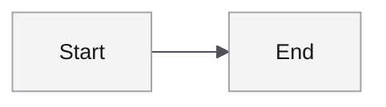

# Mermaid House Style — Planning Notes

**Status:** DRAFT. Not implemented. Open decisions below.
**Goal:** Make Mermaid diagrams consistent, pretty, and reusable across the vault — so every diagram the model writes (and every diagram the user copies from a template) shares the same look-and-feel without per-diagram tweaking.
**Companion skill (already shipped):** `obsidian-bridge:mermaid` — syntax reference, no style opinions yet.

---

## Three mechanisms (stack as needed)

| # | Mechanism | What it does | Where it lives | Effort |
|---|---|---|---|---|
| 1 | House-style `%%{init}%%` block | Every new diagram opens with the same JSON5 init: theme, font, edge curve, spacing, palette. Model auto-prepends. | New `## House Style` section in `skills/mermaid/SKILL.md` + a copy of the canonical block | Low |
| 2 | Starter templates | Copy-pasteable skeletons for the most-used diagram types, with house style baked in. | `examples/mermaid/` (new dir) — `flowchart.md`, `sequence.md`, `erd.md`, `state.md`, `mindmap.md` | Low |
| 3 | Obsidian CSS snippet | Visual polish that `%%{init}%%` cannot reach (font smoothing, node corner radius, link weight, spacing inside Obsidian's reading view). | `examples/obsidian-css/mermaid.css` (new) — user manually drops into vault `.obsidian/snippets/` | Medium (needs design pass + render testing in actual Obsidian) |

**Recommended order:** ship 1+2 together (one PR), defer 3 to its own pass.

---

## Open decisions (pick before implementing 1+2)

### 1. Theme base
- `base` — overridable by `themeVariables`. Recommended.
- `default` — fixed, cleaner out of the box, harder to tweak.

### 2. Edge curve (flowcharts)
- `basis` — smooth bezier, most readable at scale. **Recommended.**
- `linear` — straight segments. Cleaner for grid-aligned diagrams.
- `cardinal` — middle ground.

### 3. Default flowchart direction
- `LR` (left → right) — narrow vertically, fits embedded between paragraphs. **Recommended default.**
- `TB` (top → bottom) — natural for hierarchies; switch case-by-case.

### 4. Font family
- Match Obsidian body font (leave `fontFamily` unset — inherits). **Recommended for prose-embedded diagrams.**
- Pin a stack like `"Inter, system-ui, sans-serif"` for cross-vault consistency.
- Pin a monospace inside nodes when nodes contain code/identifiers.

### 5. Palette
- **Bridge-neutral:** greys + 1 accent. Diagrams read as structural, not decorative. **Recommended.**
- Themed: multiple accents per diagram type. More visual variety, less consistent.
- `primaryColor` overridable per-diagram regardless of choice.

### 6. Templates to include in `examples/mermaid/`
Recommend the subset that covers ~80% of real use:
- `flowchart.md` — LR with one decision and two outcomes.
- `sequence.md` — two participants, request/response, an aside note.
- `erd.md` — two entities with cardinality and a few attributes.
- `state.md` — start state, two transitions, terminal state.
- `mindmap.md` — root with two branches, two leaves each.

Skip on first pass: gantt, gitGraph, pie, quadrant, journey, C4 (less frequent; users can read the `mermaid` skill for syntax when needed).

---

## Sketch of the house-style init block (illustrative, not final)

Numbers and colours are placeholders — finalise after the palette decision.

---

## Caveats / things to verify

- **Obsidian's bundled Mermaid version may lag mainline.** `%%{init}%%` features added in newer Mermaid (e.g. `lookAndFeel`, `look: handDrawn`) may not render. Test in actual Obsidian before promoting.
- **`themeVariables` casing matters** — Mermaid is camelCase, easy to typo as kebab-case from CSS habit.
- **`useMaxWidth: true`** lets diagrams scale to container width — usually right inside Obsidian; may want `false` for fixed-width screenshot exports.
- **Per-diagram overrides** must come AFTER the house init block, not before — Mermaid takes the last `%%{init}%%` only.
- **Inside callouts** the indentation of the init block must match the callout's continuation indent (`> `), or it silently breaks.

---

## When picking this up — implementation checklist

- [ ] User signs off on the 6 decisions above (or says "your defaults").
- [ ] Add `## House Style` section to `skills/mermaid/SKILL.md` with the finalised init block + the rule "prepend to every new diagram unless explicitly overridden."
- [ ] Create `examples/mermaid/` with the 5 starter templates, each opening with the house init block.
- [ ] Cross-link from the skill's `## Cross-References` section to `examples/mermaid/`.
- [ ] Update `ATTRIBUTIONS.md` only if any template borrows from upstream (none planned).
- [ ] Render test: paste each starter template into a real Obsidian vault and visually verify.
- [ ] Optional: open follow-up issue for mechanism 3 (Obsidian CSS snippet).

---

## See also

- `skills/mermaid/SKILL.md` — current syntax reference (no style opinions yet).
- Mermaid config docs: <https://mermaid.js.org/config/configuration.html>
- Mermaid theme variables: <https://mermaid.js.org/config/theming.html>
